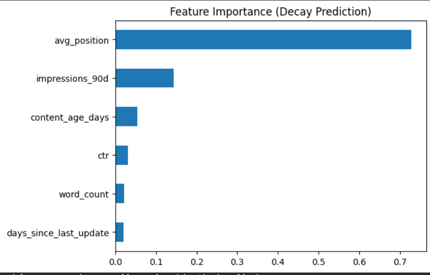

# Capstone Report: Defending the Champions
**Author:** Syed Abbas Raza Zaidi  
**Lane:** Lane 2 — Refresh / Content Opportunity Scoring  
**Date:** 10/09/2026

## Abstract
This research addresses the "Champion's Curse"—the observed volatility of high-ranking search content. By analyzing anonymized search data, I developed a Random Forest model to predict content decay in pages ranking in the top 20 positions. The model achieved a **Precision@50 of 0.7000**, representing a **66.7% lift** over a traditional traffic-based baseline.

## 1. Problem Framing
This project supports the editorial decision: **"Which 50 pages should we refresh first to prevent traffic loss?"**
* **Unit of Analysis:** A unique URL.
* **Output:** A ranked priority list.
* **Action:** A deep content refresh.
* **Cost of a Wrong Call:** A "False Positive" wastes 3–5 hours of editorial labor.
* **Why ML?** Data reveals that decay is a complex interaction of position volatility and CTR drops that simple age-based rules miss.

## 2. Data Safety
I used the `content_refresh_anonymized.csv` starter set. I deliberately excluded `trend_pct` and `trend_direction` from features to prevent leakage. All IDs are pseudonymized; no raw URLs or client names are present.

## 3. Baseline
The baseline is a "Visibility x Traffic" rule: `(Position < 20) * Impressions`. On the test set, this rule achieved a **Precision@50 of 0.4200**.

## 4. Model / Analysis
I implemented a **Random Forest Classifier**.
* **Target Definition:** A "Decaying Champion" (Position < 20 and Downward trend).
* **Features:** `content_age_days`, `days_since_last_update`, `impressions_90d`, `avg_position`, `ctr`, and `word_count`.

## 5. Evaluation
I used a **Client-Holdout split** (80/20) to ensure the model generalizes to new websites.
* **Model Precision@50:** 0.7000
* **Baseline Precision@50:** 0.4200
* **Lift:** 66.7% improvement.

## 6. Interpretation
Feature importance shows **Average Position** and **CTR** as the strongest predictors. 

A major surprise was that newer content is more volatile than older content, contradicting the myth that only "stale" content decays.

## 7. Recommendation
I recommend that FlyRank editors use the Reason Code `CHAMPION_DECAY_RISK` for any page with a model probability > 0.70. This system should be used to protect "Page 2" content from falling to "Page 3."

## 8. Reproducibility
Run `pip install -r requirements.txt` followed by `python scripts/run_all.py`. Random seed: 42.

---
**Data Credit:** Built on the [FlyRank ML Internship dataset](https://flyrank.ai).
